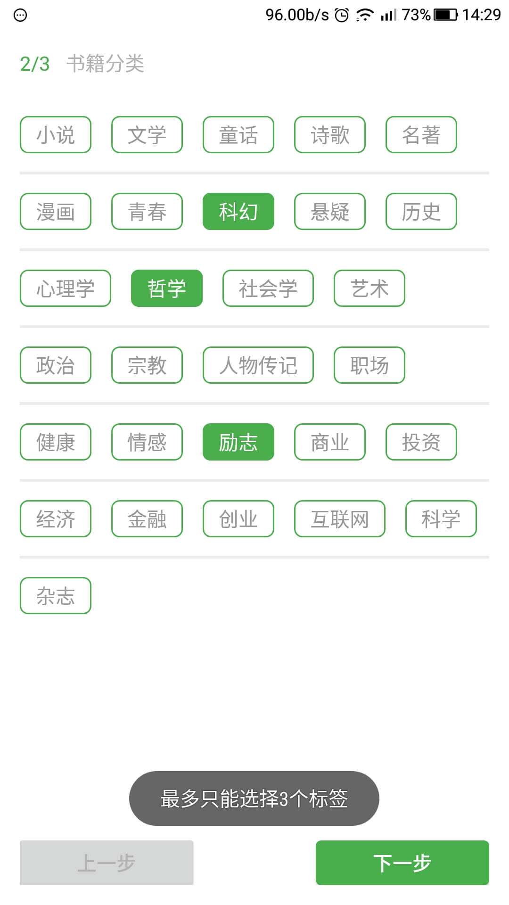
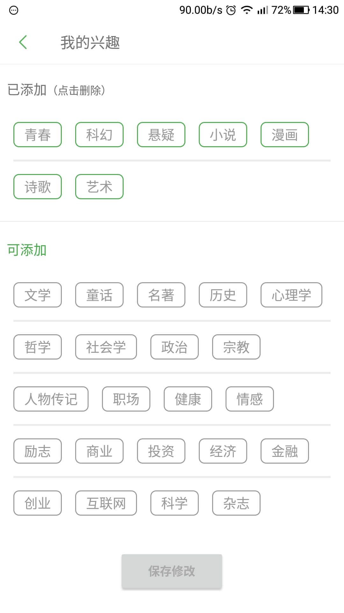

## 最简洁的标签（label/tag）选择/展示控件----LabelLayout
LabelLayout只是用于标签布局(layout)，搭配CheckBox使用，标签样式可以随意更换，完全没有束缚，小而精悍。（支持API 9 及以上）

### Demo图
    

### 属性
- label_horizontalSpacing  水平方向上标签之间的距离
- label_verticalSpacing  竖直方向上标签之间的距离
- label_checkboxLayout  传入CheckBox布局（也就是标签的样式） 
- label_enableDivider  是否需要在标签行间加分割线，默认为**false**
- label_dividerHeight  行间分割线的高度
- label_dividerColor 行间分割线的颜色

### 使用
#### 添加gradle依赖
```
compile 'com.lcodecorex:labellayout:1.0.1'
```

#### 方法及回调
1. 定义标签数据Bean实现ILabel接口
```java
public interface ILabel {
    //warning! Ids should be unique!!!
    public String getId();
    public String getName();
}
```
注意getId()放回的id值必须是独特的，不可重复。

2. layout布局
```xml
<com.lcodecorex.LabelLayout
    android:id="@+id/label_me"
    android:layout_width="match_parent"
    android:layout_height="wrap_content"
    android:layout_margin="16dp"
    app:label_horizontalPadding="16dp"
    app:label_horizontalSpacing="16dp"
    app:label_verticalPadding="16dp"
    app:label_verticalSpacing="32dp"
    app:enableDivider="true" />
```

2. 设置标签,使用setLabels()方法
```java
labelLayout.setLabels(List<ILabel> labels);
```

3. 添加标签选择监听器
```java
label_me.setOnCheckChangedListener(new LabelLayout.OnCheckListener() {
            @Override
            public void onCheckChanged(ILabel label,boolean isChecked) {}
            
             @Override
             public void onBeyondMaxCheckCount() {
             
             }
        });
```

4. 如果是需要选择标签，可以调用setMaxCheckCount(int)方法，选中的标签超过这个数checkListener的onBeyondMaxCheckCount()方法会被回调。

6. 其它方法
- getCheckedLabelsCount 获取当前被选中的标签数量
- getCheckedLabelIds() 获取被选中的标签的id列表
- getCheckedIdsAsJson() 获取json序列化之后的id的json串

#### 个性化(可参考默认样式：view_label_common.xml)
--- 主布局
```xml
<com.lcodecorex.LabelLayout
    android:id="@+id/label_all"
    android:layout_width="match_parent"
    android:layout_height="wrap_content"
    android:layout_margin="16dp"
    app:label_horizontalPadding="16dp"
    app:label_horizontalSpacing="16dp"
    app:label_verticalPadding="16dp"
    app:label_verticalSpacing="32dp"
    app:checkboxLayout="@layout/checkbox_gray"
    app:enableDivider="true" />
```

--- checkbox_gray.xml
```xml
<?xml version="1.0" encoding="utf-8"?>
<CheckBox xmlns:android="http://schemas.android.com/apk/res/android"
    android:layout_width="wrap_content"
    android:layout_height="32dp"
    android:layout_margin="10dp"
    android:background="@drawable/label_selector_gray"
    android:button="@null"
    android:paddingBottom="4dp"
    android:paddingLeft="13dp"
    android:paddingRight="13dp"
    android:paddingTop="4dp"
    android:textColor="#999"
    android:textSize="16sp" />
```

--- 图一中用的CheckBox样式
```xml
<?xml version="1.0" encoding="utf-8"?><!--推荐列表用到的标签显示checkbox-->
<CheckBox xmlns:android="http://schemas.android.com/apk/res/android"
    android:layout_width="wrap_content"
    android:layout_height="32dp"
    android:background="@null"
    android:button="@null"
    android:paddingRight="4dp"
    android:textColor="@color/colorPrimary"
    android:textSize="12sp" />
```

> ps
> Contact me：lcodecore@163.com
